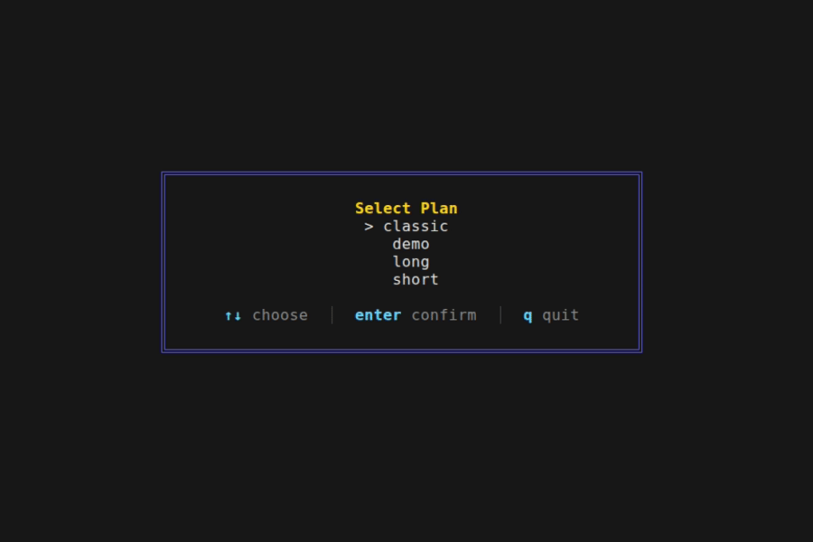

# temgo

[](https://go.dev/)
[](https://github.com/venexene/temgo/actions)
[](https://goreportcard.com/report/github.com/venexene/temgo)
[](LICENSE)

A focused work timer for the terminal. Two modes: CLI and TUI powered by Bubble Tea.



## Install

```
go install github.com/venexene/temgo@latest
```

Or build from source:

```
git clone https://github.com/venexene/temgo
cd temgo
make build
```

## CLI

```
temgo start               # default plan (classic unless changed)
temgo start -P short      # one-off run with a different preset
temgo start -P long       # just as easily
```

Without a flag, the plan set via `config set` is used. Defaults to classic.

A single-line countdown is shown on screen. A system notification and sound play when the phase changes. Ctrl+C exits, saving the incomplete phase to history. History file: `~/.temgo/history.jsonl`.

## TUI

```
temgo tui
```

On launch — a list of plans from `~/.temgo/plans/`. Arrow keys to pick, Enter to start.

Timer screen:
- phase and cycle counter
- phase icon and name
- phase message
- countdown timer
- progress bar
- key hints

| Key | Action |
|-----|--------|
| `space` | pause / resume |
| `s`     | skip phase |
| `q`     | back to plan selection |
| `Ctrl+C`| quit |

`s` marks the phase as unfinished in history. `q` flushes accumulated history to disk before returning.

## Plans

JSON format. Sections contain phases. Both sections and the plan itself have a `repeat` count.

Built-in presets:
- **classic** – 10s prologue → 4×(25min + 5min) → 30min rest, ×3
- **short** – 3×(15min + 3min) → 15min rest, ×2
- **long** – 3×(50min + 10min) → 30min rest, ×2

Phase fields:

| Field | Purpose |
|-------|---------|
| `type` | identifier |
| `duration` | length: `"25m"`, `"10s"`, `"1h30m"` |
| `name` | name shown in TUI |
| `icon` | emoji displayed in the header |
| `text` | text on the timer screen |
| `message` | text in the system notification on phase change |
| `color` | progress bar color, HEX |

Plan fields:

| Field | Purpose |
|-------|---------|
| `sections` | list of sections, executed in order |
| `sections[].phases` | phases within a section |
| `sections[].repeat` | how many times to repeat the section |
| `repeat` | how many times to repeat the entire plan |

Minimal full plan example:

```json
{
  "sections": [
    {
      "phases": [
        {"type": "work", "duration": "30m", "name": "Coding", "icon": "💻", "text": "Focus", "message": "Go!", "color": "#00FF00"},
        {"type": "rest", "duration": "10m", "name": "Break",  "icon": "💤", "text": "Relax", "message": "Pause", "color": "#87CEEB"}
      ],
      "repeat": 2
    }
  ],
  "repeat": 1
}
```

Custom plans go into `~/.temgo/plans/` and are picked up automatically.

## Plan management

```
temgo config list           list all available plans
temgo config add file.json  add a custom plan
temgo config delete name    delete a plan
temgo config set name       set as the default plan
temgo config show name      show plan structure
```

## Statistics

```
temgo stats                 all time, human-readable output
temgo stats --today         today only
temgo stats --week          this week (starting Monday)
temgo stats --all --json    machine-readable JSON
temgo stats --all --csv     CSV for Excel
```

With `--csv` or `--json`, the text header goes to stderr and data to stdout. Pipe to a file: `temgo stats --all --csv > report.csv`.

## Structure

```
main.go              entry point, subcommand routing
internal/
  plan               model, iterator, builder, JSON I/O, config
  timer              timer engine, context-based cancellation, ticker
  tui                Bubble Tea: plan selector, timer, rendering
  history            session journal in JSONL, date filtering
  commands           subcommand handlers: start, tui, config, stats
```

Architecture:
- `PlanIterator` — walks through sections and repeats.
- `Builder` — fluent API for building plans in code.
- `Duration` — custom type, JSON marshaling `"25m"` ↔ `time.Duration`.
- Context-based cancellation: `signal.NotifyContext` in CLI, `tea.Quit` in TUI.
- TUI — three-layer rendering: `JoinVertical` → `boxStyle.Render` → `lipgloss.Place`.
- Data is stored in `~/.temgo/`: plans, history, config.
- Built-in presets via `//go:embed` — the binary is self-contained.
- `LoadRange` — history filtering by date range for `stats`.